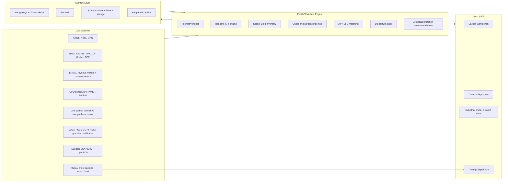

# AIDC CO2 Lifecycle Monitoring Platform

AIDC CO2 is a prototype platform for AI data center carbon monitoring, lifecycle carbon accounting, quota supervision, 24/7 carbon-free energy matching, AI decarbonization, and digital-twin-based environmental and power monitoring.

The current implementation targets an AIDC / AI Data Center campus. It combines:

- near-real-time digital MRV (`NRT-dMRV`)
- lifecycle assessment (`LCA`)
- GHG Protocol Scope 1/2/3 inventory
- location-based and market-based Scope 2 reporting
- cabinet, server, and chip-level digital-twin carbon allocation
- 24/7 carbon-free energy matching
- industrial BMS / EPMS / cooling SCADA-style dynamic environment monitoring
- photoreal Three.js and OpenUSD / Omniverse integration contracts

## Current Screens

The app exposes three main operator surfaces:

- `/`: operational carbon workbench for KPI cards, cabinet/server/chip twin inspection, lifecycle inventory, quota risk, CFE matching, AI optimization, and evidence status.
- `/bigscreen`: campus carbon command center for a 16:9 wall display, with 3D campus overview, real-time carbon/electricity/cooling/water indicators, quota/CFE rings, alerts, and MEP summaries.
- `/bms`: Siemens/Honeywell-style industrial dynamic environment monitoring interface, including machine-room floor plan, rack/sensor overlays, cooling P&ID, system parameter settings, alarm radar, CCTV strip, and BMS/EPMS protocol status.

Generated screenshots are stored under `artifacts/`:

- `artifacts/aidc-campus-bigscreen.png`
- `artifacts/aidc-campus-photoreal-aerial.png`
- `artifacts/aidc-photoreal-twin.png`
- `artifacts/aidc-photoreal-twin-crop.png`

## Architecture



## Repository Layout

```text
.
├── apps/web
│   ├── src/app/page.tsx              # operational carbon workbench
│   ├── src/app/bigscreen/page.tsx    # campus command-center bigscreen
│   ├── src/app/bms/page.tsx          # industrial BMS / SCADA-style monitoring
│   ├── src/components/TwinScene.tsx  # cabinet/server/chip 3D twin
│   ├── src/components/CampusScene.tsx# campus 3D twin
│   └── src/lib                      # API types and fallback sample data
├── services/api
│   ├── app/main.py                   # FastAPI endpoints
│   ├── app/models.py                 # Pydantic domain models
│   ├── app/calculations.py           # accounting and matching formulas
│   ├── app/sample_data.py            # demo site, telemetry, twin, MEP data
│   └── tests                         # API and formula tests
├── db/schema.sql                     # TimescaleDB/PostGIS persistence schema
├── infra/docker-compose.yml          # TimescaleDB, Redpanda, MinIO
├── docs
│   ├── methodology.md
│   ├── digital-twin-toolchain.md
│   ├── omniverse-fidelity-policy.md
│   └── photoreal-material-and-mep-model.md
├── tools
│   ├── digital-twin-toolchain.json
│   └── omniverse-accounting-toolchain.json
└── scripts/open_digital_twin_downloads.sh
```

## Implemented Capabilities

### Carbon Accounting

- Scope 1: backup fuel, refrigerant leakage, and onsite combustion categories.
- Scope 2: location-based and market-based electricity emissions are calculated and disclosed separately.
- Scope 3: embodied carbon amortization for GPU servers, network equipment, building/envelope elements, and other LCA components.
- Offsets and avoided emissions are explicitly separate disclosures and do not reduce physical emissions, SCI, or server-layer carbon metrics.

### Realtime Data Center KPIs

The realtime engine computes:

- `PUE = facility_energy_kwh / it_energy_kwh`
- `CUE = kgCO2e / IT kWh`
- `WUE = water_liters / IT kWh`
- `REF = renewable_energy_kwh / facility_energy_kwh`
- location-based emissions
- market-based emissions

All calculated metrics carry:

- `method_version`
- `data_quality_flag`
- `uncertainty_range`

### 24/7 Renewable Matching

The platform uses hourly matching as the primary renewable-energy metric:

```text
CFE Score = sum(min(load_h, eligible_CFE_h)) / sum(load_h)
```

Annual matching is shown as disclosure only. Marginal avoided emissions are calculated separately and are not mixed into inventory totals.

### Quota Monitoring

Quota monitoring supports:

- annual or period-based carbon budget
- remaining quota
- used percentage
- forecast exceedance date
- compliance gap
- carbon price risk
- dispatch hints for decarbonization

### Digital Twin Hierarchy

The digital twin allocation graph is:

```text
campus -> building -> room -> rack -> server -> chip
```

Seeded demo data currently includes:

- 1 campus
- 1 compute building
- 2 AI halls
- 12 racks
- 72 servers
- 1,152 chip twins
- 5 envelope components
- 6 primary cooling nodes
- 5 electrical metering nodes

### Chip-Level Simulation

Each seeded server includes package-level twins:

- 8 GPU packages
- 2 CPU packages
- 4 HBM packages
- 1 DPU
- 1 VRM array

For each chip the API exposes:

- current power
- utilization
- junction temperature
- hotspot temperature
- coolant flow
- thermal resistance
- carbon rate
- material reference
- NVML / Redfish sensor references

The current solver is a reduced-order liquid/air thermal network intended for monitoring and anomaly triage. It is not a replacement for detailed CFD/FEA; production deployments should bind calibrated solver output back to `ChipTwin`.

### Industrial Dynamic Environment Monitoring

The `/bms` route implements a SCADA-style view inspired by industrial BMS / EPMS / cooling-group-control systems:

- machine-room floor plan with cyan rack glyphs and sensor overlays
- hot/cold aisle bands
- temperature and humidity probe overlays
- alarm radar, alarm count, and alarm list
- cooling P&ID with chilled water, condenser water, power, pumps, chillers, storage tank, headers, valves, pressure, and flow annotations
- system parameter table for wet-bulb limits, pump delay, butterfly valve delay, pressure differential, cooling tower setpoints, minimum flow, and automatic rotation
- CCTV strip and operator toolbar
- BMS protocol status for BACnet/IP, OPC UA, Modbus TCP, DCIM, and EPMS

This view is intentionally operational and dense. It is designed for wall displays and control-room use rather than a marketing dashboard.

### Photoreal and Engineering Digital Twin

The browser runtime uses Three.js PBR materials for:

- high-angle aerial campus rendering
- sage-green AI compute halls with silver metallic roofs
- rooftop high-density cooling equipment, CDU, fans, pumps, and pipe headers
- roads, parking, security fencing, and campus hardscape
- surrounding agricultural fields and distant wind turbines for 24/7 CFE context
- anti-static floor tiles
- wall and roof panels
- glass containment
- cable trays
- pipe loops
- electrical cabinets
- chillers, pumps, CDU, CRAH
- racks, server blades, PCB, and chip packages

The `/bigscreen` campus scene includes subtle digital-twin overlays:

- carbon-intensity heatmap plates on roofs
- animated chilled-water, power, CFE, and emissions flow lines
- floating PUE, CFE, quota, and location-based carbon KPI rings
- moving cooling fans and wind-turbine rotors
- atmospheric daylight haze for an Omniverse/RTX-style presentation baseline

The engineering-signoff target is OpenUSD / Omniverse:

- OpenUSD is the high-fidelity source-of-truth scene graph.
- Omniverse RTX Real-Time is the operations rendering target.
- Omniverse RTX Interactive Path Tracing is the sign-off rendering target.
- Three.js is the browser-native fallback for normal monitoring.

Rhino desktop, Rhino.Compute, Omniverse, and commercial LCA factor databases are license-controlled. The repo records official integration routes and does not silently install licensed desktop software.

## Public API

### Health

```http
GET /health
```

### Telemetry Ingest

```http
POST /ingest/telemetry
```

Accepts meter readings for a site. All readings must match `site_id`.

### Realtime Metrics

```http
GET /metrics/realtime?site_id=aidc-sg-01&interval_minutes=5
```

Returns PUE, CUE, WUE, REF, location-based emissions, market-based emissions, and source quality metadata.

### Digital Twin

```http
GET /digital-twin/{site_id}
```

Returns campus/building/room/rack/server/chip hierarchy, envelope components, cooling equipment, electrical metering topology, and server-layer audit lines.

### Chip Simulation

```http
GET /digital-twin/{site_id}/chip-simulation?rack_id=...&server_id=...
```

Returns reduced-order thermal/power/carbon simulation data for one server's chips.

### Server-Layer Carbon Audit

```http
GET /carbon-audit/server-layer?site_id=aidc-sg-01&level=server
```

`level` can be:

- `campus`
- `building`
- `room`
- `rack`
- `server`
- `all`

### Photorealism Policy

```http
GET /photorealism/omniverse-policy/{site_id}
```

Returns OpenUSD/Omniverse renderer modes, tool integrations, quality gates, and accounting controls.

### Inventory

```http
GET /inventory?site_id=aidc-sg-01&period=2026-06
```

Returns Scope 1, Scope 2 location-based, Scope 2 market-based, Scope 3, offsets-separate-disclosure, and inventory totals.

### Quota Status

```http
GET /quota/status?site_id=aidc-sg-01
```

Returns used quota, remaining quota, forecast exceedance date, compliance gap, and carbon price risk.

### Renewable Matching

```http
POST /renewables/matching
Content-Type: application/json

{
  "site_id": "aidc-sg-01"
}
```

Returns hourly CFE score, annual match ratio, avoided emissions disclosure, unmatched load, and duplicate certificate IDs.

### Optimizer Recommendations

```http
POST /optimizer/recommendations
Content-Type: application/json

{
  "site_id": "aidc-sg-01",
  "max_sla_temperature_c": 27,
  "allow_deferrable_workload_shift": true
}
```

Returns AI decarbonization suggestions with baseline, estimated reduction, confidence, safety constraints, and rationale.

### Evidence Package

```http
GET /evidence/packages/{period}?site_id=aidc-sg-01
```

Returns inventory hash, method versions, evidence references, data-quality summary, and S3-style storage URI.

## Data Model Highlights

Core domain objects:

- `Site`
- `Asset`
- `MeterReading`
- `GridCarbonIntensity`
- `EmissionFactor`
- `EnergyCertificate`
- `PPAContract`
- `AIWorkloadRun`
- `LCAComponent`
- `EmissionRecord`
- `QuotaPolicy`
- `QuotaAllocation`
- `EvidencePackage`
- `CampusTwin`
- `BuildingTwin`
- `RoomTwin`
- `RackTwin`
- `ServerTwin`
- `ChipTwin`
- `EnvelopeComponentTwin`
- `CoolingEquipmentTwin`
- `ElectricalEquipmentTwin`
- `CarbonAuditLine`

Persistence tables include:

- `meter_readings`
- `grid_carbon_intensity`
- `energy_certificates`
- `ppa_contracts`
- `ai_workload_runs`
- `lca_components`
- `emission_records`
- `quota_policies`
- `evidence_packages`
- `digital_twin_model_sources`
- `twin_buildings`
- `twin_rooms`
- `twin_racks`
- `twin_servers`
- `twin_chips`
- `envelope_components`
- `cooling_equipment`
- `electrical_equipment`
- `carbon_audit_lines`
- `photoreal_tool_integrations`
- `photoreal_pipeline_stages`
- `photoreal_quality_gates`
- `accounting_tool_integrations`

## Local Development

### Prerequisites

- Node.js 20+
- npm 10+
- Python 3.11+
- Optional: Docker and Docker Compose for TimescaleDB, Redpanda, and MinIO

### Install Web Dependencies

```bash
npm install
```

### Install API Dependencies

```bash
python3 -m venv .venv
source .venv/bin/activate
pip install -e "services/api[test]"
```

Alternative from the API folder:

```bash
cd services/api
python3 -m venv .venv
source .venv/bin/activate
pip install -e ".[test]"
```

### Start API

```bash
source .venv/bin/activate
cd services/api
uvicorn app.main:app --reload --host 127.0.0.1 --port 8000
```

Or:

```bash
npm run dev:api
```

### Start Web App

```bash
npm run dev:web
```

Open:

- `http://localhost:3000/`
- `http://localhost:3000/bigscreen`
- `http://localhost:3000/bms`

### Optional Infrastructure

```bash
cd infra
docker compose up -d
```

Services:

- TimescaleDB/PostGIS on PostgreSQL
- Redpanda / Kafka-compatible streaming
- MinIO / S3-compatible evidence storage

Apply schema manually if needed:

```bash
psql "$DATABASE_URL" -f db/schema.sql
```

## Verification

Run API tests:

```bash
source .venv/bin/activate
pytest services/api
```

Run web lint:

```bash
npm run lint:web
```

Build web app:

```bash
npm run build:web
```

Expected current status:

- API tests: 18 passed
- Web lint: passed
- Web production build: passed

## Example API Calls

```bash
curl -s http://127.0.0.1:8000/metrics/realtime | jq
```

```bash
curl -s http://127.0.0.1:8000/digital-twin/aidc-sg-01 | jq '{rack_count, server_count, chip_count}'
```

```bash
curl -s 'http://127.0.0.1:8000/digital-twin/aidc-sg-01/chip-simulation?rack_id=sg-b1-hall-a-rack-A01&server_id=sg-b1-hall-a-rack-A01-srv-01' | jq
```

```bash
curl -s -X POST http://127.0.0.1:8000/renewables/matching \
  -H 'Content-Type: application/json' \
  -d '{"site_id":"aidc-sg-01"}' | jq
```

## Toolchain Notes

Installed npm runtime packages:

- `three`
- `@types/three`
- `rhino3dm`

Official tool routes documented in the repo:

- Rhino 8 / Grasshopper for high-precision geometry authoring.
- Rhino.Compute for geometry and Grasshopper automation.
- Speckle for model synchronization and version lineage.
- IFC / buildingSMART for open BIM identity.
- LAS / E57 point cloud for as-built verification.
- OpenUSD / Omniverse Kit for photoreal engineering digital twin.
- openLCA IPC and licensed LCA databases for supply-chain factors.

Open official desktop/service download pages:

```bash
./scripts/open_digital_twin_downloads.sh
```

## Scientific and Accounting Boundaries

The platform uses a site + grid boundary by default. It is designed to be globally extensible rather than tied to one national policy.

Important accounting rules:

- Scope 2 location-based and market-based values must be disclosed separately.
- EAC, REC, GO, I-REC, granular certificates, PPAs, and offsets do not reduce physical emissions indicators.
- Avoided emissions are separate disclosure, based on marginal emissions, and are not inventory deductions.
- SCI and physical performance metrics use physical electricity/carbon data rather than offset-adjusted values.
- All estimates must carry method version, data-quality flag, uncertainty range, and evidence references.

## Production Integration Roadmap

The prototype is structured so production deployments can add:

- real DCIM/PDU/UPS/BMS/EPMS ingest
- BACnet/IP, OPC UA, Modbus TCP connectors
- Redpanda streaming topics for telemetry
- Timescale continuous aggregates for 1/5/15/60 minute KPIs
- MinIO/S3 evidence retention and hash manifests
- user authentication and role-based access control
- site-specific ETS/carbon-tax policy packages
- actual PPA/EAC registry APIs
- calibrated CFD/thermal solver integration
- OpenUSD/Omniverse streaming for high-fidelity operator review
- openLCA/economic input-output LCA factor pipelines

## Known Limits

- The current repository uses deterministic seeded demo data, not live site telemetry.
- Rhino desktop, Rhino.Compute, Omniverse RTX, ecoinvent, and some grid/carbon APIs require licenses or external service credentials.
- The Three.js scene is an operational browser twin, not a certified CFD or path-traced engineering model.
- The industrial BMS view is a platform-native interface inspired by SCADA systems; it is not a Siemens or Honeywell product and does not redistribute their software.
- Real carbon accounting deployments require reviewed emission factors, source system access, evidence retention policy, and auditor sign-off.
