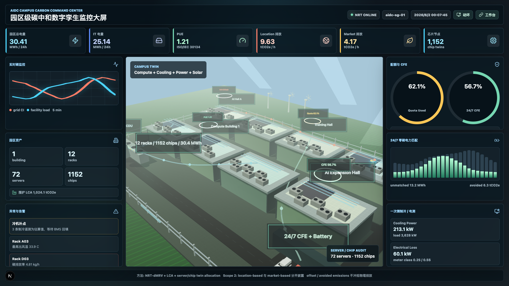

# A near-real-time digital-twin methodology for full life-cycle carbon verification of AI data centres

**Target journal:** *Technology Review for Carbon Neutrality* (TRCN), Research Article format
**Manuscript type:** Methodological research article
**Status:** Pre-submission draft for scientific and editorial review

## Title

A near-real-time digital-twin methodology for full life-cycle carbon verification of AI data centres from campus to chip

## Authors

Author names and affiliations to be completed before submission.

## Abstract

Artificial-intelligence data centres (AIDCs) are becoming critical energy infrastructures whose operational electricity demand, water use, embodied emissions and grid interactions evolve at sub-hourly time scales. Existing carbon accounting approaches are still dominated by periodic inventories, coarse facility-level allocation, annual renewable-energy matching and heterogeneous evidence trails. These practices are insufficient for high-density AIDCs, where decisions at the level of workload scheduling, liquid cooling, rack power distribution, backup generation and renewable procurement can change physical emissions within minutes. Here we propose a methodological framework for near-real-time digital monitoring, reporting and verification (NRT-dMRV) of full life-cycle AIDC carbon emissions. The framework integrates corporate greenhouse-gas accounting, product life-cycle assessment, data-centre key performance indicators, software carbon intensity, hourly carbon-free electricity matching and a multi-resolution digital twin spanning campus, building, room, rack, server and chip. We formalize boundary definitions, data models, temporal harmonization, Scope 1/2/3 calculations, uncertainty propagation, server- and chip-level allocation, quota forecasting, evidence packaging and safety-constrained AI decarbonization recommendations. The framework explicitly separates physical location-based emissions, market-based electricity claims, avoided emissions and offsets, preventing the conflation of procurement instruments with real-time operational performance. A reference implementation in a Next.js and FastAPI prototype demonstrates how the method can support command-centre visualization, industrial BMS-style environmental monitoring and auditable carbon records. We argue that AIDC decarbonization requires a shift from annual disclosure dashboards to verifiable operational carbon control systems, with data provenance, uncertainty and engineering constraints treated as first-class methodological objects.

**Keywords:** AI data centre; digital twin; carbon monitoring; dMRV; life-cycle assessment; Scope 2; carbon-free energy; software carbon intensity; PUE; carbon quota

## Significance statement

The rapid expansion of AI computing changes the methodological requirements of carbon accounting. Facility-level annual inventories cannot reveal whether a specific GPU cluster, training run, cooling setpoint or renewable certificate has reduced physical emissions. This paper proposes a verifiable methodology for AIDCs in which carbon accounting is coupled to operational telemetry and an engineering digital twin. The contribution is not a new emission factor, but an integrated scientific protocol: every carbon estimate is tied to an asset, a time interval, a method version, a data-quality flag, an uncertainty range and an evidence package. The approach is designed to help researchers, operators, auditors and policymakers distinguish real operational decarbonization from annual matching or offset-based claims.

## 1. Introduction

Artificial intelligence is changing the geography, timing and controllability of electricity demand. Modern AIDCs concentrate high-density accelerators, liquid cooling, backup power, power-conversion equipment, storage systems and renewable-energy contracts into campus-scale infrastructures. The International Energy Agency (IEA) has identified data centres as a central channel through which AI affects the energy system, while also emphasizing that AI may support energy-system optimization if deployed with appropriate governance [1]. The methodological question is therefore not whether AI is good or bad for decarbonization in the abstract, but how its infrastructure can be measured, attributed, controlled and verified at the temporal and spatial resolution at which decisions are made.

Two strands of prior work motivate this study. First, near-real-time emission systems such as Carbon Monitor and GRACED have shown that emissions can be inferred from dynamic activity data rather than only from delayed annual statistics [2-5]. These systems were designed for countries, sectors, grids or cities; AIDCs require an analogous paradigm at the level of assets and workloads. Second, data-centre energy studies show that aggregate electricity demand and efficiency trends can mask sharp variations across facility design, hardware generation, cooling system and utilization [6,7]. A high-efficiency hyperscale site and an underutilized, fossil-powered cluster may both report annual energy and renewable procurement, yet their marginal operational consequences are different.

Carbon accounting standards provide a necessary foundation. The Greenhouse Gas Protocol defines organizational Scope 1, 2 and 3 reporting [8-11], while ISO life-cycle standards guide product carbon footprinting [12-14]. ISO/IEC 30134 defines data-centre key performance indicators such as power usage effectiveness (PUE), carbon usage effectiveness (CUE) and water usage effectiveness (WUE) [15-17], and ISO/IEC 21031 provides a specification for software carbon intensity (SCI) [18]. However, these standards were not designed as a single operational control architecture for high-frequency AIDC monitoring. In practice, AIDC operators must reconcile electricity meters, PDU and busway measurements, BMS and EPMS tags, GPU telemetry, cooling-loop data, maintenance logs, refrigerant inventories, supplier life-cycle data, PPA contracts, energy attribute certificates and policy-specific quotas.

Annual renewable-energy matching adds another methodological challenge. The move toward 24/7 carbon-free energy (CFE) recognizes that annual volumetric matching does not guarantee clean electricity consumption during every hour or within the relevant grid region [19-23]. For AIDCs, this distinction is material because workloads can be delayed, shifted, batched or migrated, and storage can be charged or discharged in response to time-varying carbon intensity. Yet electricity procurement instruments should not be treated as direct reductions of physical emissions unless their temporal, locational and eligibility constraints are explicit.

The fourth motivation is the emergence of digital measuring, reporting and verification (dMRV). MRV is central to carbon markets and climate governance [24], but conventional MRV is often costly, periodic and manually intensive. Recent dMRV literature argues that digital systems can improve the timeliness, transparency and reliability of decarbonization evidence [25]. AIDCs are unusually suitable for dMRV because they already contain dense instrumentation. The limiting factor is not the absence of sensors; it is the lack of a rigorous method that converts heterogeneous telemetry into auditable carbon claims across engineering, accounting and policy boundaries.

This paper develops such a method. We define an NRT-dMRV plus life-cycle assessment (LCA) framework for AIDCs, implemented around a multi-resolution digital twin. The proposed method differs from a visual digital twin or a carbon dashboard in five ways. First, the digital twin is an accounting graph as well as a 3D scene. Second, all emissions are attributed to time intervals and assets. Third, physical emissions, market-based disclosures, avoided emissions and offsets are kept in separate ledgers. Fourth, uncertainty and data quality are propagated to every metric. Fifth, optimization recommendations are constrained by service-level, thermal, redundancy and compliance requirements.

## 2. Conceptual framework

### 2.1 System boundary

The default boundary is **site + grid**. The site includes all assets under operational control within the AIDC campus: compute buildings, rooms, racks, servers, accelerators, network equipment, power-conversion systems, UPS, batteries, cooling systems, backup generators, fuel storage, refrigerant systems, water systems and building envelope components. The grid boundary is the balancing authority, bidding zone, national grid or electricity market region used for location-based carbon-intensity factors and 24/7 CFE matching. The boundary can be extended to multi-region cloud scheduling by representing each site-grid pair as a separate carbon node.

The digital twin hierarchy is:

```text
campus -> building -> room -> rack -> server -> chip/package
```

Each node has a stable identity, parent-child relation, operational telemetry references, embodied-carbon references and evidence references. The hierarchy is a directed acyclic graph rather than a simple tree when shared assets exist. For example, one chiller plant can serve multiple rooms, a UPS train can feed several switchboards, and a PPA can be allocated to multiple sites. Shared assets are represented by allocation edges with method-versioned allocation factors.

### 2.2 Emissions ledgers

The framework uses four ledgers:

1. **Physical ledger:** direct emissions and location-based electricity emissions calculated from physical activity and grid carbon intensity.
2. **Market-based ledger:** contractual Scope 2 disclosures using qualified instruments, residual factors and supplier-specific factors where applicable.
3. **Avoided-emissions ledger:** marginal or consequential estimates from workload shifting, storage dispatch or renewable procurement impacts, reported separately.
4. **Offset ledger:** voluntary credits or removals, reported separately and not used to reduce physical KPIs, SCI or server-layer emissions.

This separation is central. It prevents double counting and avoids the common practice of using annual procurement instruments to obscure hourly fossil electricity consumption. It also allows a regulator, auditor or customer to inspect both inventory-compliant disclosures and operational decarbonization performance.

### 2.3 Digital-twin fidelity levels

We define four fidelity levels:

- **Level 0: Inventory twin.** Static asset register, emission factors and organizational boundaries.
- **Level 1: Telemetry twin.** Time-series measurements from meters, BMS, EPMS, DCIM, GPU telemetry and environmental sensors.
- **Level 2: Allocation twin.** Method-versioned allocation from facility energy to racks, servers, chips and workloads.
- **Level 3: Mechanistic twin.** Calibrated thermal, hydraulic, electrical or CFD/FEA models used for prediction and control.

The prototype visualization is a browser-native Three.js PBR twin. The engineering sign-off target is an OpenUSD or comparable high-fidelity scene graph linked to BIM/IFC, point clouds and calibrated simulation. The accounting method is independent of the rendering engine; visual realism does not by itself imply verification quality.

## 3. Data model

Table 1 summarizes the core objects.

**Table 1. Core methodological entities.**

| Entity | Role in carbon verification | Required methodological metadata |
|---|---|---|
| Site | Defines organizational and grid boundary | region, grid zone, timezone, reporting policy |
| Asset | Represents physical equipment or building components | parent asset, commissioning date, evidence references |
| MeterReading | Stores measured telemetry | source system, interval, unit, quality flag |
| GridCarbonIntensity | Defines location-based and marginal factors | region, timestamp, method, uncertainty |
| EmissionFactor | Converts activity to emissions | scope, gas, source, validity period |
| EnergyCertificate | Represents EAC/REC/GO/I-REC/GC instruments | generation interval, region, eligibility, retirement ID |
| PPAContract | Represents contractual renewable procurement | generation asset, delivery region, contract term |
| AIWorkloadRun | Represents training, inference or batch job | model, scheduler, server/rack, runtime, output unit |
| LCAComponent | Stores embodied-carbon data | EPD/LCA source, lifetime, amortization rule |
| EmissionRecord | Stores calculated emissions | scope, ledger, method version, uncertainty |
| QuotaPolicy | Defines ETS, carbon-tax or internal budget rule | cap, price, compliance period |
| EvidencePackage | Archives inputs and calculations | hash, provenance, reviewer state |

Each calculated record must include:

```text
asset_id, interval_start, interval_end, ledger, scope,
activity_value, emission_factor_id, emissions_kg_co2e,
method_version, data_quality_flag, uncertainty_low,
uncertainty_high, evidence_refs
```

The use of provenance metadata follows the FAIR data principles [26] and is compatible with W3C PROV-style evidence graphs [27]. This is important because carbon verification often fails not because a formula is unknown, but because the origin, transformation and applicability of input data cannot be reconstructed.

## 4. Calculation methodology

### 4.1 Temporal harmonization

AIDCs generate telemetry at different granularities: second-level power data, one-minute BMS data, five-minute PDU data, hourly grid carbon intensity, monthly invoices and annual LCA factors. The framework normalizes all time-series data into canonical intervals:

```text
Δt ∈ {1 min, 5 min, 15 min, 60 min, reporting period}
```

All timestamps are stored in UTC with site-local timezone annotations. Daylight-saving transitions are handled by interval identity, not by local clock labels. For a variable `x` measured at irregular times, interval aggregation uses a time-weighted average for intensive variables and an integral for extensive variables:

```text
P̄_{a,t} = (1/Δt) ∫_t P_a(τ)dτ
E_{a,t} = ∫_t P_a(τ)dτ
```

Missing data are imputed only when the imputation method is explicitly recorded. The default quality flags are:

```text
M = measured
R = reconciled from redundant meters
E = estimated from model
S = supplier-reported
P = policy/default factor
X = excluded or failed validation
```

### 4.2 Scope 1

Scope 1 includes backup diesel or gas combustion, onsite combustion, fugitive refrigerants and other direct emissions under operational control:

```text
S1_t = Σ_f A_{f,t} EF_f + Σ_r Leak_{r,t} GWP_r
```

where `A_{f,t}` is fuel activity, `EF_f` is the fuel emission factor, `Leak_{r,t}` is refrigerant mass leakage and `GWP_r` is the global warming potential. Backup generator tests and emergency runs are attributed to the exact interval of operation. Refrigerant losses can be recorded as event-based emissions and then allocated to reporting periods.

### 4.3 Scope 2 location-based and market-based

Location-based Scope 2 uses physical electricity consumption and grid carbon intensity:

```text
S2_LB,t = E_grid,t × CI_grid,t
```

Market-based Scope 2 is calculated separately using qualified contractual instruments and residual or supplier factors:

```text
S2_MB,t = Σ_i E_i,t × CI_contract,i,t + E_residual,t × CI_residual,t
```

Market-based matching does not alter `S2_LB,t`. The physical ledger remains the basis for operational CUE, carbon-aware scheduling and engineering control. The market-based ledger remains the basis for Scope 2 disclosure under appropriate guidance.

### 4.4 Scope 3 and life-cycle allocation

Scope 3 includes embodied emissions of servers, GPUs, CPUs, memory, network equipment, UPS, batteries, cooling equipment, building materials, transportation, maintenance, end-of-life treatment and upstream cloud services. For a component `c`:

```text
M_{c,t} = CFP_c × u_{c,t} / U_c
```

where `CFP_c` is the component carbon footprint, `u_{c,t}` is utilization or time attributed to the interval, and `U_c` is the lifetime denominator. If supplier EPD or product carbon footprint data exist, they are preferred; otherwise the component is flagged as secondary-data-based. For AI workloads, embodied emissions are allocated by a hybrid of reserved time, measured utilization and hardware occupancy:

```text
M_{w,t} = Σ_c CFP_c × α_{w,c,t} / U_c
```

The allocation factor `α` must sum to no more than one for each component and interval. Idle capacity is not ignored; it is assigned to the responsible reservation pool or overhead account to prevent under-reporting by low-utilization tenants.

### 4.5 Data-centre KPIs

The platform calculates:

```text
PUE_t = E_facility,t / E_IT,t
CUE_t = S2_LB,t / E_IT,t
WUE_t = Water_t / E_IT,t
REF_t = E_renewable,t / E_facility,t
SCI_{w,t} = (E_{w,t} × I_t + M_{w,t}) / R_{w,t}
```

`R` is configurable: GPU-hour, training run, 1,000 inference requests, API call, token, batch item or business output. For comparability, SCI records must include the selected functional unit, model version, hardware class, location and inference/training mode.

### 4.6 Server and chip allocation

Server-level operational carbon is calculated from direct server power when available:

```text
E_server,t = ∫ P_server(τ)dτ
```

If only rack or PDU readings exist:

```text
E_server,t = E_rack,t × β_server,t
β_server,t = P̂_server,t / Σ_s P̂_s,t
```

where `P̂` is a power model using telemetry such as GPU power, CPU package power, memory utilization, fan power and PSU efficiency. Chip-level allocation uses measured package power where available:

```text
E_chip,t = E_server,t × P_chip,t / Σ_k P_k,t
```

Facility overhead can be assigned by IT energy share, thermal load share or causal system model. The method version must indicate which overhead allocation was used. Cooling overhead should not be assigned twice: once a facility-level PUE multiplier is used, separately metered cooling carbon must be excluded from the same allocation path.

### 4.7 24/7 CFE matching

Hourly CFE score is:

```text
CFE_score = Σ_h min(Load_h, EligibleCFE_h) / Σ_h Load_h
```

Eligibility requires time stamp, location, generation technology, certificate uniqueness, retirement status and contract validity. Annual matching can be disclosed but is not treated as the primary operational decarbonization metric. Avoided emissions are calculated separately:

```text
Avoided_t = ΔE_t × MEF_t
```

where `MEF_t` is a marginal emission factor. Avoided emissions are consequential estimates and are not deducted from inventories.

### 4.8 Quota and carbon-price risk

For a policy or internal budget `B` over period `T`:

```text
Used_T = Σ_{t∈T} S_policy,t
Remaining_T = B - Used_T
Projected_T = Used_to_date + forecast(S_policy,t)
Gap_T = max(0, Projected_T - B)
Risk_T = Gap_T × CarbonPrice_T
```

Quota status is calculated for the total site and for sub-allocations such as department, customer, model family or project. Forecast exceedance date is the earliest interval at which cumulative expected emissions exceed the budget under a specified scenario. The system reports the forecast model and uncertainty interval.

### 4.9 AI decarbonization recommendations

Recommendations are generated only relative to a baseline:

```text
Reduction_i = Emissions_baseline - Emissions_intervention_i
```

The optimizer minimizes a weighted objective:

```text
min Σ_t [λ_c Emissions_t + λ_p Cost_t + λ_w Water_t + λ_q QuotaPenalty_t]
```

subject to:

```text
SLA_w,t ≥ SLA_min
T_inlet,r,t ≤ T_max
Redundancy_t ≥ N+1 or policy requirement
Battery_SOC_min ≤ SOC_t ≤ SOC_max
Certificate eligibility constraints
Data-residency and customer constraints
```

Recommended interventions include carbon-aware scheduling, GPU utilization improvement, batch-size tuning, model quantization, distillation, caching, cooling setpoint optimization, chilled-water reset, CDU flow optimization, storage dispatch, PPA portfolio balancing and predictive maintenance. Each recommendation must report baseline, estimated reduction, confidence, safety constraints and rebound-risk notes.

## 5. Reference implementation

We implemented the framework as an open prototype named AIDCCO2. The web layer uses Next.js and TypeScript. The method engine uses FastAPI and Python. The intended production storage layer is PostgreSQL with TimescaleDB and PostGIS, Redpanda/Kafka for telemetry streams and S3-compatible evidence storage. The browser interface includes three operator surfaces:

- an operational carbon workbench;
- a 16:9 campus command-centre bigscreen;
- an industrial BMS/SCADA-style dynamic-environment monitoring page.

The campus digital twin visualizes high-density compute halls, rooftop cooling equipment, power and cooling yards, energy-flow overlays, CFE and quota indicators, roads, fencing and surrounding renewable-energy context. The BMS-style page visualizes machine-room layout, rack overlays, cold/hot aisles, temperature/humidity probes, cooling P&ID, system parameters, alarm states and protocol connectivity. These visualizations are not substitutes for calibrated CFD or certified BIM; they are operator-facing interfaces connected to the accounting graph.

**Figure 1. Integrated AIDC NRT-dMRV architecture.** Data sources include DCIM, BMS, EPMS, PDU, UPS, GPU schedulers, water meters, fuel logs, refrigerant logs, BIM/IFC, point clouds, grid carbon intensity, LCA data and energy certificates. The method engine calculates real-time KPIs, Scope 1/2/3 inventory, 24/7 CFE matching, quota risk, workload allocation and recommendations. Results are stored with provenance and exposed through workbench, bigscreen and BMS views.

**Figure 2. Multi-resolution digital twin hierarchy.** The accounting graph maps campus assets to buildings, rooms, racks, servers and chips. Shared assets such as chillers, UPS, substations, batteries and PPAs are connected through allocation edges. Each edge carries an allocation method, time validity and uncertainty.

**Figure 3. Separation of ledgers.** Physical, market-based, avoided-emissions and offset ledgers are calculated independently. Only the physical ledger is used for operational CUE, carbon-aware control and location-based emissions. Market-based instruments are disclosed separately under Scope 2 guidance.

**Figure 4. Evidence package life cycle.** Telemetry and documents are ingested, normalized, quality-flagged, transformed, calculated, reviewed and packaged. Each package includes source references, hashes, method versions, uncertainty ranges and reviewer status.

**Figure 5. Campus digital-twin command-centre visualization.**



## 6. Validation protocol

The framework should be validated at four levels.

**Unit validation.** Formulas for Scope 1, Scope 2, Scope 3, PUE, CUE, WUE, REF, SCI, 24/7 CFE, quota balance, carbon-price risk and embodied-carbon amortization are tested against hand-calculated cases.

**Scenario validation.** The system is tested under missing telemetry, duplicate certificates, PPA expiration, daylight-saving transitions, backup-generator operation, refrigerant leakage, equipment replacement, GPU workload migration, storage charging/discharging and anomalous sensor spikes.

**Reconciliation validation.** Bottom-up server and rack estimates are reconciled against top-down meters. Differences beyond tolerance trigger data-quality downgrades, not silent overwriting.

**Audit validation.** Monthly inventory results must be traceable to raw evidence. A verifier should be able to reproduce the reported value by following the evidence package and method version.

The current prototype contains deterministic seeded data and should be interpreted as a methodological demonstrator. It does not claim measured emission reductions at a real site.

## 7. Uncertainty and materiality

Each emission record has an uncertainty interval. For activity data and emission factors with independent uncertainties, first-order propagation can be used:

```text
u_y^2 ≈ Σ_i (∂f/∂x_i)^2 u_{x_i}^2
```

For non-linear allocation, missing data or correlated inputs, Monte Carlo propagation is recommended. Uncertainty is not merely a statistical appendix; it drives operational trust. For example, an AI recommendation with an expected 2% reduction but a 5% uncertainty range should not be presented as a confident reduction. Likewise, small sources can be aggregated under materiality rules, but their exclusion must be explicit and policy-compliant.

## 8. Discussion

The proposed framework reframes AIDC carbon accounting as an operational cyber-physical measurement problem. Three implications follow.

First, **temporal resolution changes governance**. Annual reporting can document whether a company bought enough electricity attributes over a year, but it cannot verify whether a training job ran on low-carbon electricity at the hour of execution. Hourly and sub-hourly data make carbon a schedulable variable.

Second, **asset resolution changes accountability**. Facility-level carbon totals are necessary but insufficient for AIDC customers and operators. A model owner wants to know the carbon intensity of a training run; an operator wants to identify a cooling anomaly; an auditor wants evidence. The campus-to-chip graph provides a common reference.

Third, **ledger separation changes credibility**. The framework allows market-based reporting without letting procurement claims overwrite physical emissions. This is consistent with the direction of 24/7 CFE practice and reduces greenwashing risk.

The approach also clarifies where AI can reduce emissions. AI should not be treated as a generic decarbonization label. In this framework, AI is useful only when it produces a verifiable change in energy, carbon, water, reliability or maintenance outcomes under explicit constraints. This includes cooling optimization, workload scheduling, anomaly detection and predictive maintenance. The same framework also measures AI's own operational and embodied carbon.

## 9. Limitations

Several limitations remain.

First, the framework depends on access to high-quality telemetry and asset data. Many facilities lack calibrated rack-level metering, refrigerant event records or supplier-specific product carbon footprints. Second, server- and chip-level allocation remains partly model-based unless hardware exposes reliable power telemetry. Third, marginal emission factors are uncertain and jurisdiction-specific. Fourth, CFE eligibility rules are evolving. Fifth, digital-twin visual fidelity can create a false sense of verification if not connected to evidence and calibrated models. Sixth, AI optimization may cause rebound effects if efficiency gains lower the cost of additional computation. These limitations support, rather than weaken, the case for method-versioned, uncertainty-aware dMRV.

## 10. Policy and industry implications

AIDCs can become flexible loads, clean-energy anchor buyers and testbeds for high-resolution carbon governance. To realize this potential, policymakers and standards bodies should encourage:

- hourly and locational electricity carbon data access;
- granular certificate registries with double-use prevention;
- standardized server- and workload-level carbon disclosure;
- explicit separation of offsets, avoided emissions and inventory emissions;
- audit-ready evidence packages for digital carbon claims;
- interoperability between BIM/IFC, OpenUSD, DCIM, BMS, EPMS and carbon-accounting systems.

Operators should prioritize physical reductions before offsets: higher utilization, efficient cooling, low-carbon siting, temporal load flexibility, storage dispatch, clean firm procurement, liquid-cooling optimization and hardware lifetime extension. Customers should request both location-based and market-based values and should avoid comparing AI services unless the functional unit, allocation method and uncertainty are disclosed.

## 11. Conclusion

AIDCs require a carbon-accounting paradigm that is as dynamic as the infrastructure it measures. We proposed an NRT-dMRV methodology that combines life-cycle accounting, data-centre KPIs, 24/7 CFE matching, quota monitoring, provenance and a campus-to-chip digital twin. The method converts heterogeneous operational telemetry and documentary evidence into auditable carbon records with explicit uncertainty and ledger separation. It provides a pathway for moving from retrospective sustainability reporting to real-time carbon-aware operation, while preserving scientific caution about offsets, procurement claims and unvalidated AI recommendations. The next step is deployment in live AIDC facilities with calibrated metering, independent verification and cross-site benchmarking.

## Data availability

The present manuscript describes a methodology and a deterministic prototype. No confidential operational site data are included. Public standards, reports and papers used to construct the methodology are cited in the references.

## Code availability

The reference prototype is maintained in the AIDCCO2 repository. It includes a Next.js/TypeScript web interface, a FastAPI/Python method engine, deterministic sample data, tests and documentation. Production deployment requires real telemetry connectors, verified emission factors and site-specific policy configuration.

## Acknowledgements

To be completed before submission.

## Author contributions

To be completed before submission. Recommended taxonomy: conceptualization, methodology, software, validation, visualization, writing-original draft, writing-review and editing, supervision.

## Competing interests

To be completed before submission. The current draft declares no competing interests unless authors identify relevant financial or organizational relationships.

## References

1. International Energy Agency. *Energy and AI*. IEA, Paris (2025). https://www.iea.org/reports/energy-and-ai
2. Liu, Z., Ciais, P., Deng, Z. et al. Carbon Monitor, a near-real-time daily dataset of global CO2 emission from fossil fuel and cement production. *Scientific Data* **7**, 392 (2020). https://doi.org/10.1038/s41597-020-00708-7
3. Dou, X. et al. Near-real-time global gridded daily CO2 emissions. *The Innovation* **3**, 100182 (2022). https://doi.org/10.1016/j.xinn.2021.100182
4. Dou, X., Hong, J., Ciais, P. et al. Near-real-time global gridded daily CO2 emissions 2021. *Scientific Data* **10**, 69 (2023). https://doi.org/10.1038/s41597-023-01963-0
5. Huo, D. et al. Near-real-time estimates of daily CO2 emissions from 1500 cities worldwide. *Scientific Data* **9**, 533 (2022). https://doi.org/10.1038/s41597-022-01657-z
6. Masanet, E., Shehabi, A., Lei, N., Smith, S. & Koomey, J. Recalibrating global data center energy-use estimates. *Science* **367**, 984-986 (2020). https://doi.org/10.1126/science.aba3758
7. Shehabi, A. et al. *2024 United States Data Center Energy Usage Report*. Lawrence Berkeley National Laboratory, LBNL-2001637 (2024).
8. World Resources Institute & World Business Council for Sustainable Development. *The Greenhouse Gas Protocol: A Corporate Accounting and Reporting Standard, Revised Edition* (2004).
9. World Resources Institute & World Business Council for Sustainable Development. *GHG Protocol Scope 2 Guidance* (2015).
10. World Resources Institute & World Business Council for Sustainable Development. *Corporate Value Chain (Scope 3) Accounting and Reporting Standard* (2011).
11. World Resources Institute & World Business Council for Sustainable Development. *Product Life Cycle Accounting and Reporting Standard* (2011).
12. International Organization for Standardization. ISO 14067:2018, *Greenhouse gases - Carbon footprint of products - Requirements and guidelines for quantification* (2018).
13. International Organization for Standardization. ISO 14040:2006, *Environmental management - Life cycle assessment - Principles and framework* (2006).
14. International Organization for Standardization. ISO 14044:2006, *Environmental management - Life cycle assessment - Requirements and guidelines* (2006).
15. International Organization for Standardization. ISO/IEC 30134-2:2026, *Information technology - Data centres key performance indicators - Part 2: Power usage effectiveness (PUE)* (2026).
16. International Organization for Standardization. ISO/IEC 30134-8:2022, *Information technology - Data centres key performance indicators - Part 8: Carbon usage effectiveness (CUE)* (2022).
17. International Organization for Standardization. ISO/IEC 30134-9:2022, *Information technology - Data centres key performance indicators - Part 9: Water usage effectiveness (WUE)* (2022).
18. International Organization for Standardization. ISO/IEC 21031:2024, *Information technology - Software Carbon Intensity (SCI) specification* (2024).
19. U.S. Environmental Protection Agency. *24/7 Hourly Matching of Electricity* (2026). https://www.epa.gov/green-power-markets/247-hourly-matching-electricity
20. EnergyTag. *Granular Certificate Scheme Standard* (2022). https://energytag.org/standards/
21. United Nations. *24/7 Carbon-Free Energy Compact* (2021). https://www.un.org/en/energy-compacts/page/compact-247-carbon-free-energy
22. Google. *24/7 Carbon-Free Energy: Methodologies and Metrics* (2021). https://sustainability.google/reports/24x7-carbon-free-energy-methodologies-metrics/
23. Riepin, I., Jenkins, J. D., Swezey, D. & Brown, T. 24/7 carbon-free electricity matching accelerates adoption of advanced clean energy technologies. *Joule* **9**, 101808 (2025). https://doi.org/10.1016/j.joule.2024.101808
24. Bellassen, V. & Stephan, N. Accounting for carbon: monitoring, reporting and verifying emissions in the climate economy. *Nature Climate Change* **5**, 319-328 (2015). https://doi.org/10.1038/nclimate2544
25. Teubner, T., Adam, M. T. P., Camara, D. et al. Digital measuring, reporting, and verification (dMRV) for decarbonization. *Business & Information Systems Engineering* (2025). https://doi.org/10.1007/s12599-025-00953-3
26. Wilkinson, M. D. et al. The FAIR Guiding Principles for scientific data management and stewardship. *Scientific Data* **3**, 160018 (2016). https://doi.org/10.1038/sdata.2016.18
27. World Wide Web Consortium. *PROV-Overview: An Overview of the PROV Family of Documents* (2013). https://www.w3.org/TR/prov-overview/
28. Intergovernmental Panel on Climate Change. *2019 Refinement to the 2006 IPCC Guidelines for National Greenhouse Gas Inventories* (2019).
29. UNFCCC. *Modalities, procedures and guidelines for the transparency framework for action and support referred to in Article 13 of the Paris Agreement*, Decision 18/CMA.1 (2018).
30. World Bank. *State and Trends of Carbon Pricing 2025*. World Bank, Washington, DC (2025).
31. Döbbeling-Hildebrandt, N. et al. Systematic review and meta-analysis of ex-post evaluations on the effectiveness of carbon pricing. *Nature Communications* **15**, 4147 (2024). https://doi.org/10.1038/s41467-024-48512-w
32. Tao, F., Zhang, H., Liu, A. & Nee, A. Y. C. Digital twin in industry: state-of-the-art. *IEEE Transactions on Industrial Informatics* **15**, 2405-2415 (2019). https://doi.org/10.1109/TII.2018.2873186
33. Tao, F., Zhang, M. & Nee, A. Y. C. *Digital Twin Driven Smart Manufacturing*. Academic Press (2019).
34. Tao, F., Zhang, M., Liu, Y. & Nee, A. Y. C. Digital twin driven smart manufacturing: connotation, reference model, applications and research issues. *Robotics and Computer-Integrated Manufacturing* **61**, 101837 (2020). https://doi.org/10.1016/j.rcim.2019.101837
35. Jones, D. et al. Characterising the digital twin: a systematic literature review. *CIRP Journal of Manufacturing Science and Technology* **29**, 36-52 (2020). https://doi.org/10.1016/j.cirpj.2020.02.002
36. Opoku, D.-G. J., Perera, S., Osei-Kyei, R. & Rashidi, M. Digital twin application in the construction industry: a literature review. *Journal of Building Engineering* **40**, 102726 (2021). https://doi.org/10.1016/j.jobe.2021.102726
37. Bortolini, R., Rodrigues, R., Alavi, H., Vecchia, L. F. D. & Forcada, N. Digital twins' applications for building energy efficiency: a review. *Energies* **15**, 7002 (2022). https://doi.org/10.3390/en15197002
38. Lazic, N. et al. Data center cooling using model-predictive control. *Advances in Neural Information Processing Systems* **31**, 3814-3823 (2018).
39. Google DeepMind. *DeepMind AI reduces Google data centre cooling bill by 40%* (2016). https://deepmind.google/blog/deepmind-ai-reduces-google-data-centre-cooling-bill-40/
40. Kahil, H., Sharma, S., Valisuo, P. & Elmusrati, M. Reinforcement learning for data center energy efficiency optimization: a systematic literature review and research roadmap. *Applied Energy* **389**, 125734 (2025). https://doi.org/10.1016/j.apenergy.2025.125734
41. Rolnick, D. et al. Tackling climate change with machine learning. *ACM Computing Surveys* **55**, 42 (2022). https://doi.org/10.1145/3485128
42. Kaack, L. H. et al. Aligning artificial intelligence with climate change mitigation. *Nature Climate Change* **12**, 518-527 (2022). https://doi.org/10.1038/s41558-022-01377-7
43. Strubell, E., Ganesh, A. & McCallum, A. Energy and policy considerations for deep learning in NLP. *Proceedings of ACL 2019*, 3645-3650 (2019). https://doi.org/10.18653/v1/P19-1355
44. Henderson, P. et al. Towards the systematic reporting of the energy and carbon footprints of machine learning. *Journal of Machine Learning Research* **21**, 248:1-43 (2020).
45. Lacoste, A., Luccioni, A., Schmidt, V. & Dandres, T. Quantifying the carbon emissions of machine learning. arXiv:1910.09700 (2019).
46. Lannelongue, L., Grealey, J. & Inouye, M. Green Algorithms: quantifying the carbon footprint of computation. *Advanced Science* **8**, 2100707 (2021). https://doi.org/10.1002/advs.202100707
47. Patterson, D. et al. Carbon emissions and large neural network training. arXiv:2104.10350 (2021).
48. Luccioni, A. S., Viguier, S. & Ligozat, A.-L. Estimating the carbon footprint of BLOOM, a 176B parameter language model. *Journal of Machine Learning Research* **24**, 1-15 (2023).
49. Gupta, U. et al. Chasing carbon: the elusive environmental footprint of computing. *IEEE Micro* **42**, 37-47 (2022). https://doi.org/10.1109/MM.2021.3135842
50. Schneider, I. & Mattia, T. Carbon accounting in the cloud: a methodology for allocating emissions across data center users. arXiv:2406.09645 (2024).
51. Google Cloud. *Carbon Footprint reporting methodology* (2025). https://cloud.google.com/carbon-footprint/docs/methodology
52. Amazon Web Services. *Customer Carbon Footprint Tool methodology* (2025). https://docs.aws.amazon.com/sustainability/latest/userguide/what-is-ccft.html
53. Cloud Carbon Footprint. *Methodology* (2026). https://www.cloudcarbonfootprint.org/docs/methodology/
54. Green Software Foundation. *Software Carbon Intensity Specification* (2024). https://greensoftware.foundation/standards/sci/
55. Sepulveda, N. A., Jenkins, J. D., de Sisternes, F. J. & Lester, R. K. The role of firm low-carbon electricity resources in deep decarbonization of power generation. *Joule* **2**, 2403-2420 (2018). https://doi.org/10.1016/j.joule.2018.08.006
56. U.S. Environmental Protection Agency. *Energy Attribute Certificates (EACs)* (2025). https://www.epa.gov/green-power-markets/energy-attribute-certificates-eacs
